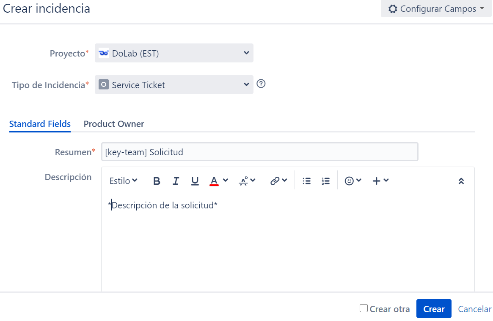

# Contactar al equipo DevOps

El equipo de DevOps cumple una función como movilizador y apoyo a otros equipos de trabajo. Son los responsables de guiar en las metodologías de desarrollo de software centrándose en la comunicación, colaboración e integración entre desarrolladores de software y el equipo de operaciones.

## Contacto

Para contactar al grupo de DevOps se usa la creación de incidencias en la herramienta de Jira@IBM. Cada equipo de trabajo debe tener asignado un proyecto y tablero asociado en el cual se crea la incidencia respectiva.

Al crear una incidencia en Jira@IBM se pide escoger el tipo de esta; como un estándar general del equipo de DevOps, cada vez que se haga una solicitud de contacto el tipo de incidencia debe ser *service ticket*. 

En la casilla *resume* se agrega el  *team-Key* del equipo al que se pertenece y un título significativo sobre la clase de solicitud que se desea hacer. 

La incidencia permite agregar una descripción; en este espacio se debe escribir con mayor detalle la solicitud. Por último, se asigna el responsable de este incidente; esta será la persona asignada del equipo de DevOps al equipo de trabajo o la persona correspondiente como movilizador del equipo de DevOps.

