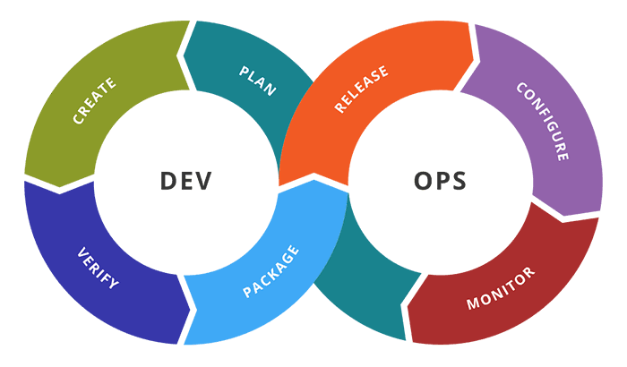
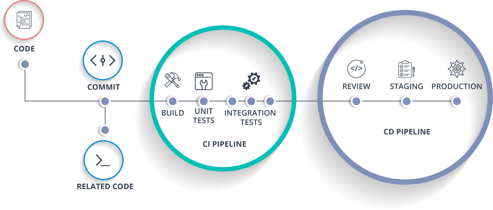

# ¿Qué es DevOps?

Este acrónimo viene de la combinación entre los términos _Developement_ (desarrollo) y _Operations_ (Operaciones). Representa una cultura, una nueva forma de pensar que representa una mejor incorporación de los equipos de desarrollo y operaciones con ayuda de la automatización de varios pasos que anteriormente se hacían manualmente. 

El uso de esta metodología de trabajo trae consigo varias ventajas como:
* Reducir en gran medida el tiempo que tarda una solución en llegar al mercado.
* Lograr una mejor adaptación al mercado y a la competencia.
* Facilita el mantenimiento y mejora la confiabilidad en el sistema.
* Mejora el tiempo medio de recuperación.

En la cultura DevOps no hay silos de trabajo independientes, por el contrario, todos los roles dentro del equipo están implicados de alguna forma en cada una de las fases.

## Ciclo de Vida de las Aplicaciones

## Cultura de DevOps

* Es fundamental la colaboración entre los equipos. Compartir procesos, priodidades y preocupaciones con el equipo para planear de maneja conjunta el trabajo alineando los objetivos e indicadores de éxito.

* Impletar prácticas ágiles es útil para poder acortar los ciclos de lanzamientos de versiones. El progreso se hace incrementalmente, gracias a esto se puede adaptar mejor a las organizaciones porque se puede reaccionar a las necesidades cambiantes de los clientes.

* Se debe tener una mentalidad de aprendizaje continuio. Cada integrante debe estar dispuesto a crecer, utilizando los fracasos como oportunidades de mejora.

## Practicas DevOps

### CI/CD _Continuous Integration & Continuous Delivery_

#### Integración Continua: 
* Tener un repositorio central con el código.
* Los desarrolladores actualizan su código frecuentemente (hacer `commit` del código mínimo una vez al día).
* El _build_ se debe activar cada vez que un desarrollador actualice el código.
* El _build_ debe ser automatizado y rápido, debe compilar el código.
*  Reparar un _build_ fallido debe ser la prioridad de los desarrolladores.
* Los resultados de cada _build_ deben ser comunicados a todos los desarolladores.

Para el _build_ se implementa una _pipeline_ que toma el código de la rama master del repositorio lo compila,  lo empaqueta y lo testea tanto con test unitarios como como test de la UI.

#### Entrega Continua:
* No puede existir sin antes tener integración continua.
* Bajo esta práctica se puede hacer _release_ del software a producción en cualquier momento.
* A pesar de que se automatizan la mayoría de los pasos, se necesita que alguien tome la decisión final de desplegar los cambios. 

Se hace uso de una _pipeline_ para el _release_ en la que se parte del paquete generado por la _pipeline_ del _build_, luego se hace uso de scripts automatizados para alistar el _deploy_, después se prueba el ambiente. Una vez el equipo de control de calidad certifique la aplicación está, puede ser desplegada. 

### Manifiesto DevOps

1. **Todo es código**
    
    El código son los planos de las aplicaciones. El código fuente es almacenado en un repositorio y tiene una pipeline (tubería) que transforma y lleva el código fuente al ambiente ejecución. Desde la infraestructura y la configuración hasta los cambios a la producción pueden ser código. Cuando todo es código, todo necesita DevOps. 

2. **Establecer fuentes confiables**
    
    Los recursos de la empresa usados para montar aplicaciones deben tener su propio ciclo de vida, su propia pipeline y su propio ciclo de vida de desarrollo. Estos recursos debe ser confiables y faciles de utilizar, para esto se deben almacenar en repositorios con su propio conjunto de actividades definidos en el pipeline que los mejoren, aseguren y verifiquen. Una vez se le confiera el estado de conbiable a estos activos deben ser publicados para su utilización.

3. **Inclinarse a menos privilegios**
    
    El principio de la menor cantidad de privilegios (PoLp: Principle of Least Privilege) establece que los sistemas, procesos y usuarios solo deben tener acceso a los recursos que sean necesarios para completar sus tareas. Se deben definir roles y ajustar los permisos de acceso y modificación necesarios para cada rol. Esto mitiga riesgos y reduce la exposición. 

4. **Todo es observable**
    
    Los mecanismos que van desde tener una idea hasta tener la caracterisica resultado de la idea desplegada en producción puede ser un proceso largo. Por lo tanto es necesario recolectar informacion sobre los eventos de las pipelines para construir métricas que permitan establecer medidas de los entregables. Con la tecnología de AI para pipelines se puede predecir la calidad de un producto digital antes de que exista.

5. **Expandir la definición de todo** 
    
    DevOps no es solo para código de las aplicaciones. DevOps se puede aplicar a modelos de machine learning, integración, infraestructura, configuración y otros dominios. Se debe buscar expandir los stakeholders para incluir seguridad y auditores y asi llegar a la siguiente evolución de romper los silos de trabajo.

