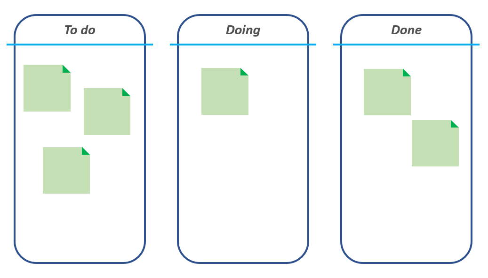
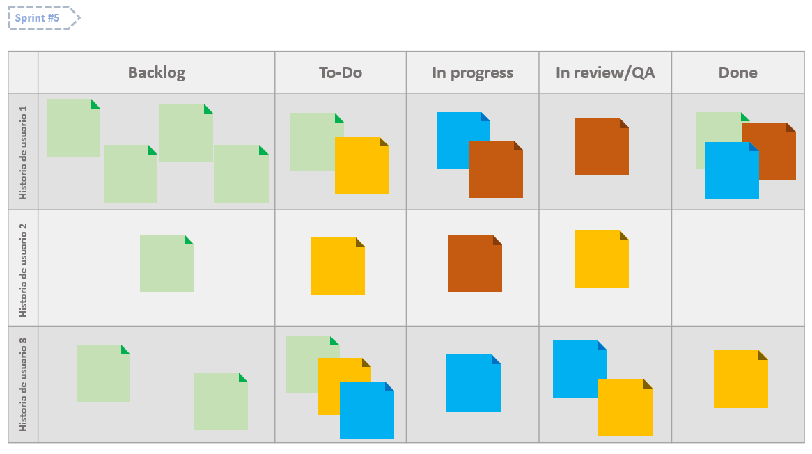

# Metodología Ágil 
La metodología ágil es una abilidad cuyo propósito es crear y responder de manera exitosa a cambios presentados en un entorno. Es un conjunto de valores humanos y una manera de trabajar cuyo enfoque es reconocer la volatilidad que se presenta en espacios de desarrollo y presenta estrategias para que el equipo encargado pueda responder sin que se salga de control la situación. Generalmente esta metodología se utiliza como aproximación efectiva al desarrollo de software.
## Desarrollo ágil de software
El desarrollo ágil de software es un conjunto de prácticas y frameworks basados en los items expresados en el Manifiesto Ágil y los 12 principios generados a partir de dicho manifiesto. Algo que diferencia a esta metodología para el desarrollo de software es el enfoque que se da en la humanidad de los integrantes del equipo y como el éxito del proyecto recae en el trabajo grupal y auto-regulado. 

## Manifiesto ágil
El Manifiesto ágil fue firmado por los críticos Kent Beck, Mike Beedle, Arie van Bennekum, Alistair Cockburn, Ward Cunningham, Martin Fowler, James Grenning, Jim Highsmith, Andrew Hunt, Ron Jeffries, Jon Kern, Brian Marick, Robert C. Martin, Steve Mellor, Ken Schwaber, Jeff Sutherland y Dave Thomas el 12 de Febrero de 2001 como respuesta a los métodos formales y "pesados" existentes para desarrollo de software, en aras de buscar metodologías humanas, eficientes y flexibles al cambio.
El manifiesto ágil expone:

_Estamos descubriendo formas mejores de desarrollar software tanto por nuestra propia experiencia como ayudando a terceros. A través de este trabajo hemos aprendido a valorar:_

* _Individuos e interacciones sobre procesos y herramientas_
* _Software funcionando sobre documentación extensiva_
* _Colaboración con el cliente sobre negociación contractual_
* _Respuesta ante el cambio sobre seguir un plan_

_Esto es, aunque valoramos los elementos de la derecha, valoramos más los de la izquierda._

## 12 principios del manifiesto ágil
Adicional al manifiesto ágil, los críticos redactaron los 12 principios derivados de este que componen la práctica ágil de manera exitosa. Estos principios son:

1. _Nuestra principal prioridad es satisfacer al cliente a través de la entrega temprana y continua de software con valor._
2. _Aceptamos que los requisitos cambien, incluso en etapas tardías del desarrollo. Los procesos ágiles aprovechan el cambio para proporcionar ventaja competitiva al cliente._
3. _Entregamos software funcional frecuentemente, entre dos semanas y dos meses, con preferencia al período de tiempo más corto posible._
4. _Los responsables del negocio y los desarrolladores trabajamos juntos de forma cotidiana durante todo el proyecto._
5. _Los proyectos se desarrollan en torno a individuos motivados. Hay que darles el entorno y el apoyo que necesitan, y confiarles la ejecución del trabajo._
6. _El método más eficiente y efectivo de comunicar información al equipo de desarrollo y entre sus miembros es la conversación cara a cara._
7. _El software funcionando es la medida principal de progreso._
8. _Los procesos ágiles promueven el desarrollo sostenido. Los promotores, desarrolladores y usuarios debemos mantener un ritmo constante de forma indefinida._
9. _La atención continua a la excelencia técnica y al buen diseño mejora la agilidad._
10. _La simplicidad, o el arte de maximizar la cantidad de trabajo no realizado, es esencial._
11. _Las mejores arquitecturas, requisitos y diseños emergen de equipos auto-organizados._
12. _A intervalos regulares, el equipo reflexiona sobre cómo ser más efectivo para, a continuación, ajustar y perfeccionar su comportamiento en consecuencia._

## ¿Existen estrategias para la metodología ágil en el desarrollo de software?
En el mundo del desarrollo de software ágil, existen dos grandes estrategias para la gestion de trabajos complejos: Kanban y SCRUM. Aunque esta sección no pretende actuar como una explicación extensiva de dichas estrategias, la información a profundidad de podrá encontrar en los links citados al final de cada resúmen.

### Kanban:
El sistema de planeamiento Kanban (看板), cuyo significado es letrero o valla publicitaria en japonés, fue creado por Taiichi Ohno, un ingeniero industrial en Toyota, para mejorar la eficiencia de manufactura en la empresa. 
El funcionamiento básico de un tablero Kanban comprende cinco componentes:

1. Señales visuales (normalmente son tarjetas)
2. Columnas o listas
3. Límites de tiempo para los trabajos pendientes
4. Un compromiso final de entrega
5. Una entrega final

El flujo de trabajo más común y simple comprende tres columnas: "Por hacer", "Haciéndose" y "Hecho". Como el objetivo principal es gestionar tareas y el trabajo en ellas, el equipo debe trabajar en un número definido de tareas a la vez para cada proyecto, así resulta más fácil determinar las tareas que requieren urgencia.

Un tablero básico de Kanban luce así:

Si quieres conocer más, Atlassian cuenta con una [guía básica a Kanban](https://www.atlassian.com/es/agile/kanban).

### SCRUM:
El modelo de planeamiento SCRUM fue definido a principios de los 80 por Hirotaka Takeuchi y Ikujiro Nonaka, como un resúmen de la manera en que empresas como Fuji-Xerox, Canon y Honda trabajaban para desarrollar sus productos. 
Esta estrategia cuenta con varios roles principales:
* Scrum Master: Facilita la aplicación del SCRUM y gestiona los cambios que se realicen.
* Product Owner: Representa a los interesados
* Team: Equipo que ejecuta el desarrollo y demás elementos relacionados con él.

Durante un _sprint_ (periodo corto definido por el equipo que puede ser entre una y cuatro semanas) el equipo crea un incremento de software potencialmente entregable, cuyos requisitos priorizados a desarrollar (_Historias de usuario_) se definen en un _Product Backlog_ por el _Product owner_. Durante cada sprint, los items del backlog ( también conocidos como PBI, _Product Backlog Item_) están congelados y no podrán modificarse. Así, los desarrolladores crearán una lista de los requisitos desde su punto de vista (_sprint backlog_) para lograr el incremento previsto. 

El propósito principal de la metodología SCRUM se basa en tener desarrollos tangibles en tiempos cortos, y generar progreso cuantificable en el proyecto conforme pasan los sprints.

Un tablero básico de SCRUM luce así:

