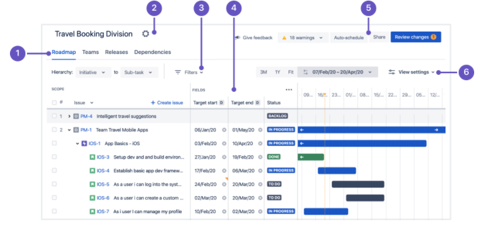
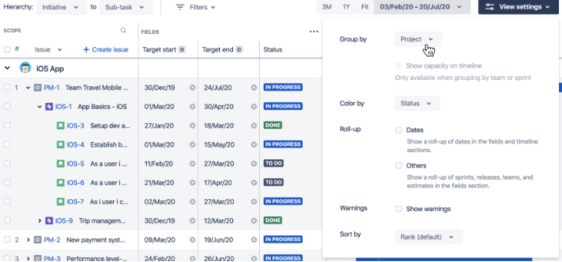

# Configuración de planes en Jira@IBM

Jira@IBM permite gestionar el trabajo en equipo, mediante la implementación y organización de planes de trabajo. Un plan, es una ruta en donde se tienen *issues*, *task* y *releases*; los cuales conforman las actividades a realizar para cumplir metas específicas.

Cuando se crea un plan, la interfaz permite realizar diferentes configuraciones para mejorar la experiencia de visualización e interpretación.

A continuación, se explican varias herramientas que presenta la interfaz al momento de crear el plan.

## 1. Visualizar el plan 
Estas pestañas ubicadas en la parte superior izquierda sirven para visualizar diferentes aspectos del plan.

* **Roadmap:** Muestra los problemas del plan al detalle. Incluyendo su posición con respecto al tiempo.

* **Teams:** permite configurar y administrar los equipos que trabajan en el plan.

* **Releases:** Configura los lanzamientos asociados al plan.

## 2. Configuración del plan

En el icono de la tuerca ubicada al lado derecho del nombre del plan, se puede realizar los ajustes a este. Se puede cambiar el nombre, la estimación, fuentes entre otras cosas.

En este mismo icono se puede eliminar el plan.

## 3. Filtrar los problemas

Para facilitar la visualización y permitirles a los equipos una rápida interpretación; con ***Filters*** se puede configurar que problemas se desean ver. Use filtros para seleccionar los problemas acordes a su etiqueta. 

## 4. Ver y trabajar los problemas en consecuencia

Esta sección es de visualización. Aquí se puede observar los problemas en jerarquía, con sus correspondientes detalles.

## 5. Botones de acción

En los 4 botones ubicados en la parte superior derecha, se pueden realizar 4 tipos de acciones para el plan:

* **Warnings:** Muestra cuantas advertencias tiene el plan. Esto es acorde a las fechas que estén desalineadas.

* **Auto-schedule:** Jira@IBM permite auto-programar los problemas del plan según los detalles.

* **Share:** Se puede compartir el plan de trabajo en una versión de solo lectura. Ya sea mediante el uso de una URL o exportar en un archivo Excel.

* **Review:** Como una buena práctica se recomienda revisar y guardar regularmente los cambios en Jira. Con el botón ***Review*** se puede seleccionar los cambios a guardar y cuales descartar.

## 6. Personalizar la vista

Se puede configurar la vista del plan, para personalizar como se muestran los datos. Esto se hace en el botón ***view settings*** en la parte superior derecha.

*  **Group by:** Agrupa problemas en carriles específicos según los atributos seleccionados.
* **Color by:** Puede codificar los problemas en función de la información relevante. Color por etiquetas, proyectos, estados etc.
* **Roll-up:** Muestra los valores de los problemas secundarios en el nivel de la jerarquía principal.
* **Warnings:** Da una notificación cuando hay un error con las fechas de los problemas.
* **Sort by:** Ordena los problemas del plan de acuerdo a la selección.

