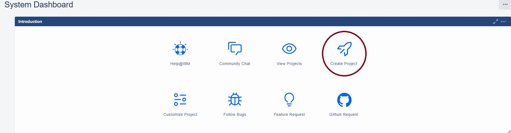
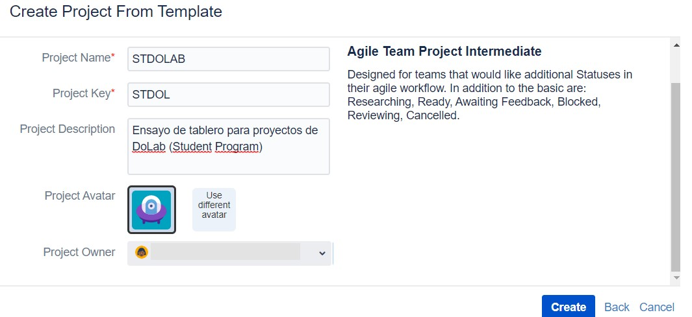
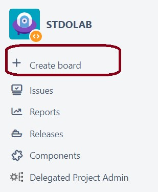
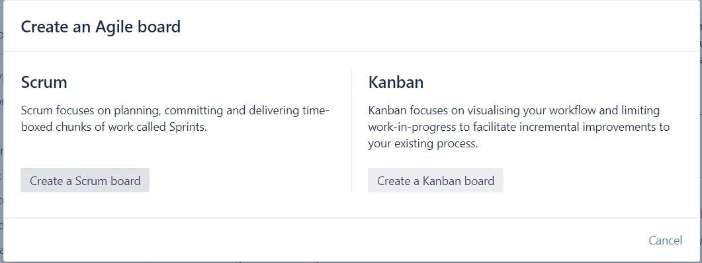
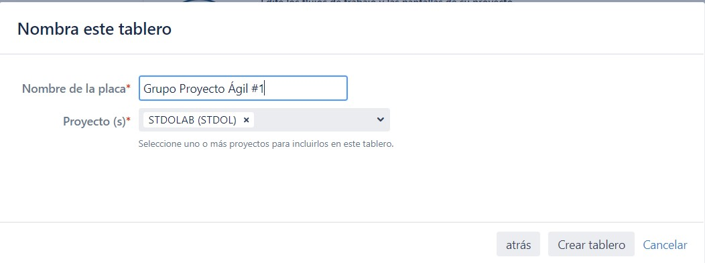

# **Configuración básica de proyecto**

Antes de comenzar en la plataforma de Jira, es importante que ingrese y se registre con la cuenta de IBM.

   ### 	Paso 1:  Crea un Proyecto

En la interfaz principal de Jira (Dashboard), se podrá ver un recuadro que da la opción de “Create Project” o “ Request Project”.

 
   ### Paso 2: Elije una plantilla y configura

Se tienen diferentes opciones de plantillas como:
* Proyecto de equipo ágil básico: La mayoría de IBM podrá utilizar esta plantilla. Es un flujo de trabajo ágil básico y un esquema de tipo de problema. Las notificaciones están configuradas para notificar al cesionario, los observadores y el informante.
* Proyecto de equipo ágil intermedio: Diseñado para equipos que deseen estados adicionales en su flujo de trabajo ágil. Además de lo básico, están: investigando, listo, esperando comentarios, bloqueado, revisando, cancelado.
* Proyecto del equipo de desarrollo: Para que los desarrolladores lo utilicen para gestionar su trabajo pendiente. Esta plantilla utiliza flujos de trabajo separados para Historias, Errores, Tareas y Épicas.
* Gestión de procesos empresariales: simplificada: Para proyectos comerciales: tipos de problemas: épico, historia, tarea, subtarea Incluye el flujo de aprobación dentro del flujo de trabajo.
* Planes: simplificado: Los usuarios de IBM podrán utilizar esta plantilla en colaboración con Portfolio for Jira. Es un esquema de flujo de trabajo y tipo de problema de jerarquía superior, que se centra en los tipos de problema de tema e iniciativa.
* Proyecto de equipo ágil escalado: Probar el flujo de trabajo, las pantallas y los campos para un flujo de trabajo "SAFe" potencial para los requisitos básicos.
* Proyecto de equipo de prueba: simplificado: Probar el flujo de trabajo, las pantallas y los campos para un posible flujo de trabajo de "Caso de prueba" para los requisitos básicos. 
* Escuadrón Agile de Infraestructura Global (Público para IBM): Desarrollado para que lo utilice un solo equipo para gestionar su trabajo pendiente (épicas, historias, etc.). Todos los empleados de IBM podrán ver y agregar comentarios.
* Portafolio Agile de Infraestructura Global (Público a IBM): Desarrollado para su uso por Sub-Dominios (agrupación de escuadrones) para administrar su cartera de proyectos / iniciativas y epopeyas compartidas. Todos los empleados de IBM podrán ver y agregar comentarios.

_**La plantilla más usada por sus características de “feedback”, “researching”, “blocked” y “cancelled” es Agile Team Project Intermediate (Proyecto de equipo ágil intermedio).**_

Una vez se elige la plantilla, se puede configurar el nombre del proyecto el cual generará por defecto una llave de proyecto  “alias”, también se puede ingresar una descripción y finalmente ingresar el dueño del proyecto (solo puede ser un usuario). 

_Para ingresar al tablero de administración ->  click  -> “Administer”._

  ### Paso 3: Crea una pizarra (Board)

Las pizarras o tableros ayudan al equipo a ponerse en marcha de una forma ágil e interactiva, cada pizarra será asignada directamente a un proyecto y también tendrá un nombre específico, en esta sección tendrán dos tableros a elección:

* Scrum : Para los equipos de metodología ágil que trabajan desde un _backlog_, planifican y estiman su trabajo en _sprints_ y entregan trabajo de forma periódica.
* Kanban: Para los equipos de metodología ágil que supervisan el trabajo en un flujo continuo (en lugar de en _sprints_) y que se centran en gestionar el trabajo en curso. (Incluye la opción de un _backlog_ de kanban).

_**Método en uso : KANBAN/SCRUM**_

En las herramientas ubicadas en la parte izquierda, se encuentra el botón de creación de _boards_.

De acuerdo a los tableros es posible elegir entre los dos modelos anteriormente mencionados y que se pueden ver a profundidad en _enlace wiki manu_

Finalmente se puede asignar un nombre al tablero, como también asignar a que proyecto estará anclado, de esta manera se tendrá listo un tablero o pizarra para comenzar a distribuir trabajos en el grupo con metodologías agiles.
