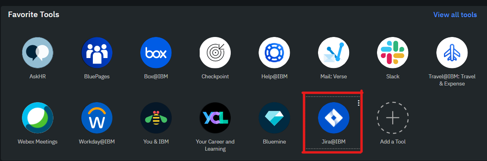

### ¿Qué es JIRA?

Jira es una herramienta de desarrollo de software creada por la empresa Atlassian (también creadora de bitbucket). Es empleada principalmente en equipos que implementan metodologías agile para planificar, supervisar y publicar software de buena calidad. Jira es muy útil para la gestión y mejora de procesos gracias a sus herramientas para la organización de flujos de trabajo. 
Con el uso de tableros es posible planificar creando historias de usuario e incidencias, planificar sprints y distribuir las tareas entre los miembros del equipo. Gracias a la vista completa y sencilla de las tareas en el tablero es posible supervisar el trabajo del equipo. Del mismo modo, al tener toda la información actualizada a la mano es posible hacer lanzamientos con seguridad y confianza. Lo anterior también permite que el equipo se informe y pueda hacer uso de los datos sobre el trabajo para mejorar su rendimiento.
Por otro lado, herramientas como los flujos de trabajo (workflow) y las hojas de ruta de producto (roadmap) es posible establecer un orden en el proceso que el equipo debe seguir para lanzar software verificando el cumplimiento de plan establecido.

Jira se puede integrar con herramientas de manejo de repositorios como GitHub o Bitbucket, herramientas de comunicación tales como Slack o Microsoft, herramientas de automatización de pipelines como GitLab o Jenkins, entre muchas otras. Esto hace que sea posible supervisar desde Jira todas las herramientas con las que el grupo trabaja.

IBM cuenta con el software de Jira para planear, manejar y rastrear los projectos en desarrollo. Debido al gran crecimiento de la compañia IBM decidió desplegar una instancia de Jira, este projecto se llama Jira@IBM. Con esto IBM logró la confianza y cumplimiento en el software necesario para mantenerse al frente del crecimiento del equipo.

Para acceder a esta herramienta se puede hacer uso del ícono Jira@IBM de las herramientas favoritas en la página de w3 (requiere activar VPN) o se puede hacer clic en el enlace que se muestra a continuación (no requiere activar VPN): [Jira@IBM dashboard](https://jsw.ibm.com/secure/Dashboard.jspa)

Al ingresar se obtiene una vista general de la herramienta desde donde se pueden explorar los proyectos, planes, tableros, entre otras cosas.

