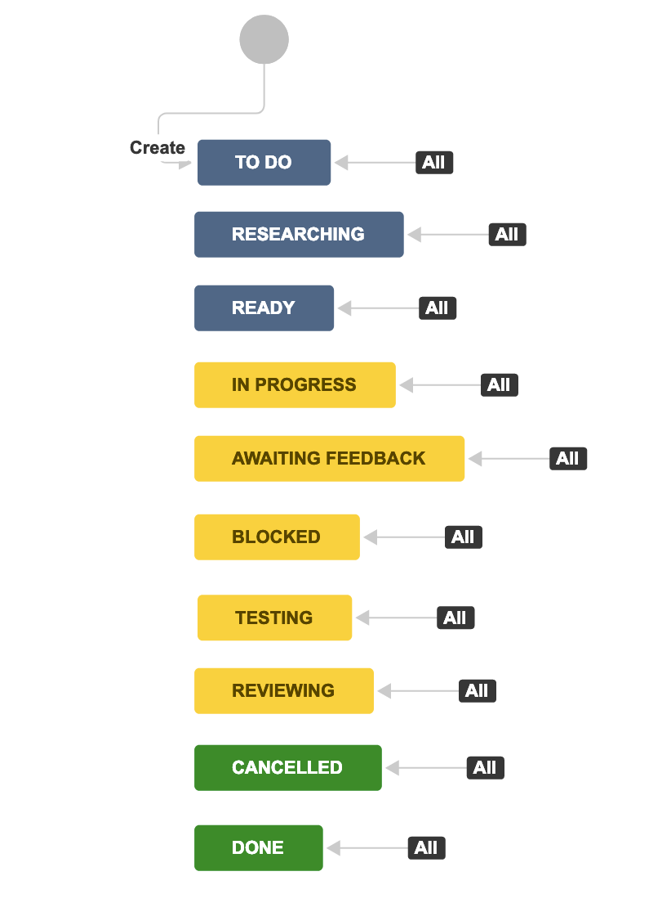

# Workflows en Jira

Un _workflow_ (o flujo de trabajo) en Jira es un conjunto de _statuses_  y _transitions_ por el que se mueve un _issue_ a través de su ciclo de vida y típicamente representa un proceso en la organización. Los workflows pueden tener una forma libre o contener caminos predeterminados por el que un issue debe pasar antes de completarse.

Un workflow de _Agile intermediate_ en Jira luce así:

* **Statuses:** describen el estado de una tarea. Son los pasos en el proceso de trabajo del equipo.
* **Transitions:** describen un enlace de un sólo sentido por el que una tarea pasa de un estado a otro.
* **Workflow scheme:** describe un conjunto de asociaciones o mapeos entre un workflow y un tipo de _issue_. Se pueden asociar tipos de issues con diferentes workflows en un _workflow scheme_ y compartir esta asociación con multiples proyectos.

Como Jira@IBM es una versión empresarial donde muchísimas personas pueden trabajar en un sólo proyecto, solamente los técnicos de Jira@IBM pueden crear _workflows_ y _schemes_. Sin embaergo, Jira@IBM contiene _workflows schemes_ ya integrados que se pueden implemnetar:

## Single workflow schemes:
Son los schemes que contienen un único workflow para cada issue.

1. Agile Development Workflow
2. Agile Production Workflow
3. Analog Design Workflow
4. Approval Workflow - Deployment Approval
5. Approval Workflow - Expanded
6. Approval Workflow - Intermediate
7. Approval Workflow - Simplified Scheme
8. P&D Workflow - Software Development Approval
9. Process Transformation Workflow
10. Provisioning Request Workflow
11. Request Workflow - Simplified And Approval
12. Request Workflow - Simplified
13. Bid and Proposal Workflow
14. Content Creation Workflow
15. Scrum Workflow - Review
16. Development Workflow - Fix and Test
17. Scrum Workflow - Intermediate
18. Scrum Workflow - Intermediate with Resolve Screen
19. Scrum Workflow - Simplified
20. Scrum Workflow - Expanded
21. Business Workflow - Process Management Simple v1
22. Business Workflow - Process Management Simple v2
23. Sales Workflow - Tracking
24. Portfolio Workflow - Simplified
25. Incident Response Workflow
26. Manufacturing Process Workflow

## Multi Workflow schemes:
Son los schemes que contienen múltiples workflows que varían para cada tipo de issue. Típicamente, contienen un workflow base con varios workflows específicos para cada issue.

1. Business Workflow - Process Management Simple
2. CIO-GI Private Cloud Workflow
3. CIO-GI Workflow
4. CIO-COS Project Workflow
5. Development - Intermediate Workflow
6. Development - Approval Simplified Workflow (Risk/Change Request)
7. Development - Approval Expanded Workflow (Story/Bug)
8. Development - Deployment Approval Workflow (Story/Bug)
9. Package and Development Workflow
10. Operations Workflow
11. Portfolio Development Workflow
12. Scrum Approval Workflow - Expanded (Epic)
13. Scrum Approval Workflow - Simplified (Epic)

## ¿Cómo cambiar un workflow en un proyecto?
El _scheme_ es una configuración que se selecciona a la hora de crear un proyecto, sin embargo, después de creado se podrá modificar el _workflow scheme_. 
Los esquemas de un proyecto, al igual que otras configuraciones, se podrán cambiar a través de la sección _Delegated Project Admin_. Solamente el/la _Project Lead_ y los/las _Project Admins_ podrán acceder a modificar el proyecto.

Para poder modificar el _workflow scheme_ en un projecto:

1. Click en _Delegated Project Admin_ en la barra izquierda, accesible una vez se está dentro del projecto en un _Staging Environment_
2. Seleccionar la pestaña de _Workflows_
3. Hacer click en el botón _Select Different Scheme_
4. En la ventana emergente, hacer click en el botón _I'm sure - Change the Workflow Scheme_
4. Seleccionar el _scheme_ que se desee utilizar dando click en su botón de _Select_

## Información adicional:
Para mayor información sobre los tipos de _workflow schemes_ y cómo funcionan, Jira@IBM cuenta con una [MURAL de inicio para el uso de Jira@IBM](https://app.mural.co/template/e2802137-af6f-4b04-a4fb-ab6fee9bbb2a/2dfa5fe2-81eb-4b48-828e-f8e28cba7042)
