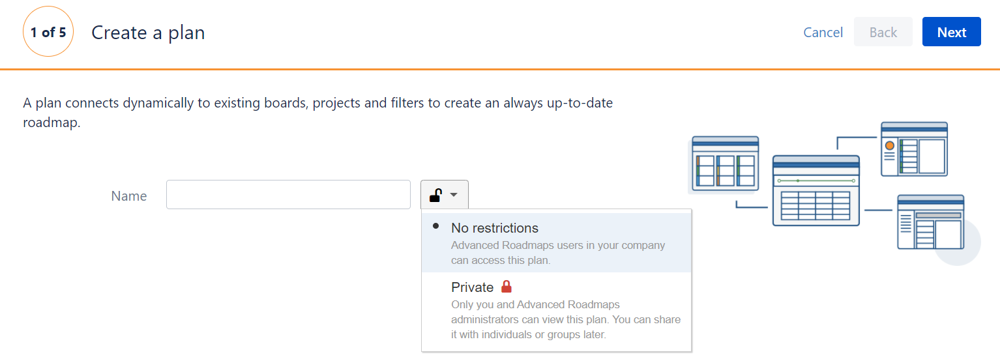
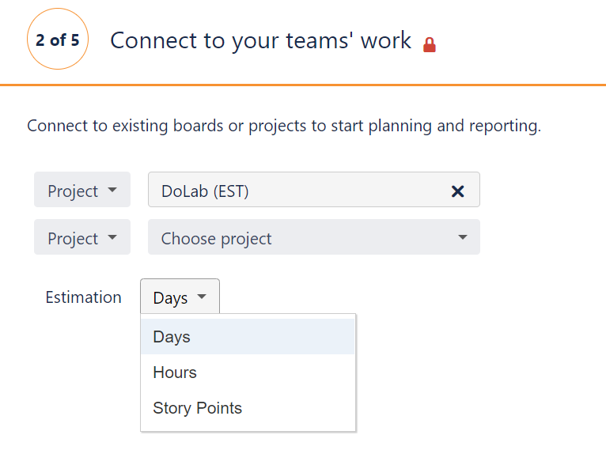
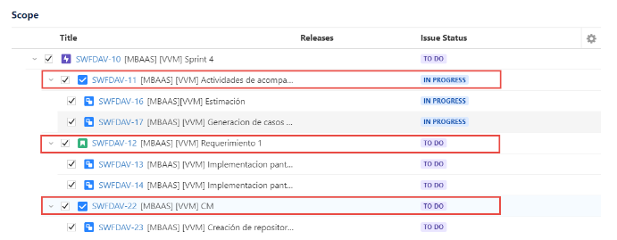
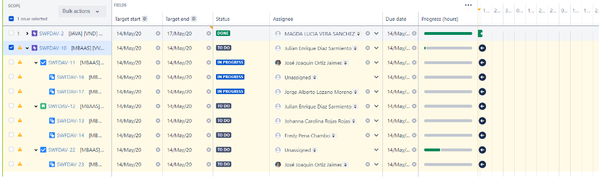

# Planes en Jira@IBM

Hacer planes en Jira Software es más fácil y cómodo para los equipos de trabajo. Este ofrece varias herramientas que permiten una alta flexibilidad, personalización y analisis en el segumiento del trabajo colaborativo.

## Acumulación de problemas

Para realizar el plan de trabajo, previamente se debío tener la acumulación de problemas. Esto significa que ya se debe tener configurado el tablero del proyecto; ya sea tipo Kanban o SCUM.

Tenga en cuenta lo siguiente:

* Hacer las cosas más importantes primero.
* Usar filtros y etiquetas para poder encontrar y organizar la información de una forma efectiva.

## Crear un plan de trabajo 

Cuando se tenga un tablero en donde se evidencie los problemas y una jerarquía; es el momento de crear el plan.

1. Se hace clic en el botón ***Plans*** en la parte superior de la interfaz y clic en ***create***. Esta muestra una ventana emergente en donde se pregunta que se desea crear.
Para este caso se escoge la opción ***plan***.

2. Se Ingresa un nombre para el plan.
     En la casilla con el candado, se puede escoger el nivel de privacidad para el plan:

    *Sin restricciones:* el cual permite que cualquier persona en la compañía pueda acceder al pan de trabajo.

    *Private:* donde solo los administradores y personas seleccionadas pueden editar o visualizar el plan. 

    Se configura esta sección según las necesidades del proyecto.

3. Se seleccionan los tableros o proyectos. En este punto se define a que tablero o proyecto se le quiere hacer el plan; se debe tener en cuenta que se puede crear planes para varios proyectos o tableros.

    Hay tres opciones:

    *Tablero:*  esta opción incluye los temas del tablero

    *Proyecto:* extrae todos los problemas del proyecto 

    *Filtro:* puede crear un plan de acuerdo con los filtros que se hayan creado previamente.

    Al escoger un plan se despliega **estimación**. Con esto se define el tiempo mínimo de visualización para cada una de las tareas, subtareas etc. Sirve para controlar tiempos. 

    Se recomienda usar la opción de horas como medida mínima, ya que permite el seguimiento del trabajo más detallado; sin embargo, se puede escoger el que mejor se adapte a las necesidades del plan.

4.   Seleccione las rutas que quiere incluir en el proyecto.

5.    Añada el equipo de trabajo o personas implicadas para este plan.

6.   Confirme. 
     En este punto se muestran los problemas que se pueden importar. Seleccionando las casillas se importarán todos los problemas asociados a esta.

## Visualizar y analizar

Para este punto se muestra una ruta acorde a las selecciones de los problemas que se decidieron importar; asimismo la interfaz despliega una línea de tiempo, el estado de cada problema, las personas encargadas, entre otras cosas.

Puede modificar la vista con los botones en la parte superior; esto permite realizar un seguimiento personalizado para el proyecto. 

Por último, hacer planes permite entender el flujo de trabajo de manera más fácil, donde se pueda dar conclusiones y retroalimentaciónes al equipo de trabajo

