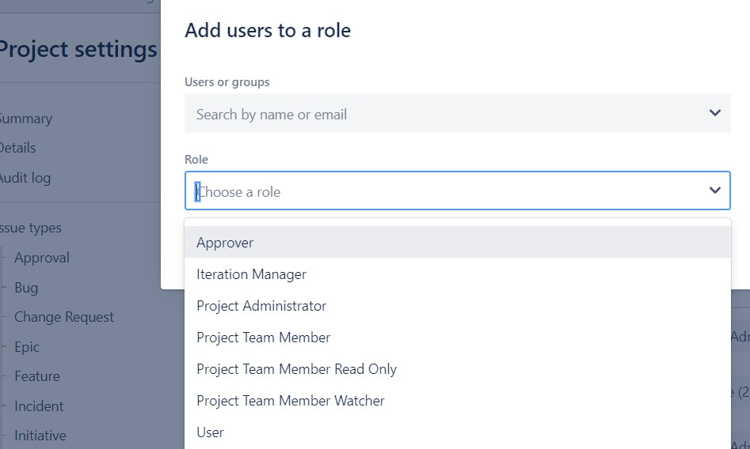

# Roles y usuarios en el proyecto

Los roles en un proyecto son una forma dinámica para poder relacionar a los usuarios con los proyectos o tareas específicas, es decir, todas aquellas personas que hacen parte del trabajo, administradores, líderes, miembros del proyecto, entre otros.

Desde las configuraciones del proyecto/usuarios y roles podemos ver los diferentes roles asignados al tablero.

Los cuales son:
*	**Approver** : Un rol de proyecto de "miembro del equipo" que se usa para realizar las aprobaciones dentro de los flujos de trabajo que lo requieren.
*	**Iteration Manager** : Un rol de proyecto que gestiona los _sprints_ en un proyecto ágil.
*	**Project Administrator** : Un rol de proyecto que representa a los administradores en un proyecto.
*	**Project Team Member** : Un rol de proyecto que se utiliza para controlar la visualización y edición de los datos del proyecto, así como la capacidad de mover problemas.
*	**Project Team Member Ready Only** : Un rol de proyecto que se usa con el esquema de permisos privados para controlar la visualización solo de los datos del proyecto.
*	**Project Team Member Watcher** : Un rol de proyecto que se usa para que los miembros obtengan las mismas actualizaciones que los observadores para todos los problemas.
*	**User** : Un rol de proyecto que permite a los usuarios abrir problemas y agregar comentarios únicamente.

Cada rol tiene asignados unos permisos los cuales definirán quien puede acceder al proyecto y que pueden hacer dentro del proyecto, todo bajo los lineamientos del Administrador de Jira.

En el equipo _DoLab_ se trabajarán con los roles *Project Administrator* quienes serán los administradores del proyecto y en este caso será conformado por los líderes/mentores de cada uno de los proyectos como también los movilizadores _DevOps_  y *Project Team Member*, un rol asignado a todos los participantes de los proyectos, donde podrán visualizar y editar.

## Gestión de roles

La gestión de roles es una sección dedicada a los administradores de Jira y administradores del proyecto, los cuales son las personas que pueden definir los roles y asignarlos.
Todos los proyectos tienen los mismos roles, sin embargo, es posible que el administrador crea conveniente solo utilizar algunos. Estos son bastante útiles para:

*	Esquemas de permisos.
*	Esquemas de notificación por email.
*	Emitir niveles de seguridad
*	Visibilidad de comentarios
*	Condiciones de flujo de trabajo.

### ¿Roles o Grupos?

La principal diferencia entre roles y grupos es que el grupo tiene una pertenencia global, mientras que los roles son pertenecientes a un especifico proyecto. Además, la configuración de grupos solo puede ser dada por administradores de Jira y la configuración de roles, puede ser alterada por los administradores de cada proyecto. Cada proyecto tiene un líder de proyecto y cada componente del proyecto tiene un líder de componente. Estos roles individuales se pueden usar en esquemas, problemas y flujos de trabajo, al igual que los roles de proyectos.

## Esquema de permisos según rol

Los permisos serán aquellas acciones delimitadas que permiten quien accede y que se puede realizar dentro de un proyecto, el esquema de permisos define como se configuran estas acciones en un proyecto.

Para acceder al esquema debe ingresar a : _*Project Settings/Permissions*_, donde podrá ver permisos como:
*	Project permissions
*	Issue Permissions
*	Voters & Watcher Permissions, Comments permissions
*	Atachment Permissions 
*	Time tracking permissions.  
