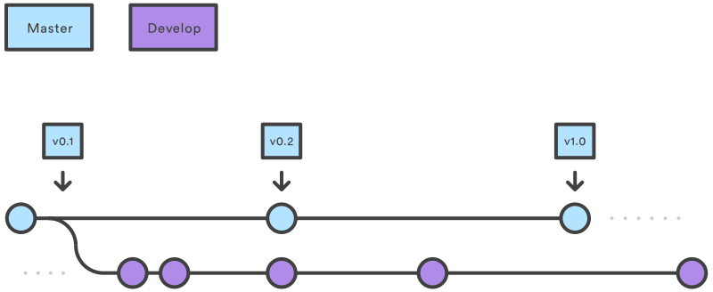

GitFlow es una convención para el desarrollo de software que busca simplificar
la integración de cambios y conservar la disponibilidad para despliegue. Las 
ramas o _branches_ son una característica fundamental de Git y GitFlow construye
sobre este concepto para organizar el trabajo distribuido.

Para conocer más sobre GitFlow puede revisar la referencia de
[Vincent Driessen][gitflow-nvie] o [Atlassian][gitflow-atlassian].
Puede encontrar una explicación detallada del sistema de ramas y los comandos
básicos para su uso en el capítulo 3 del libro [Pro Git][git-book],
secciones 3.1, 3.2 y 3.3.

## Main branch



GitFlow hace uso de las ramas `master` y `develop` para consolidar el desarrollo
en el repositorio. Sin embargo, este modelo no es compatible en ambientes de
despliegue continuo. La rama principal del repositorio dependerá del nivel de
automatización de los _releases_.

### Sin despliegue continuo

En ambientes que no realicen despliegue continuo, se utiliza la rama `develop`
como rama principal del repositorio y sobre ella se integrarán los cambios
de desarrollo. La rama `develop` representa una versión del proyecto libre de
errores, que ha sido probada exitosamente y que puede ser eventualmente desplegada.

La rama `master` representa la versión del repositorio que se encuentra en el
entorno de producción. A la hora de realizar el despliegue del repositorio,
se integran los cambios de `develop` a la rama `master`. Comúnmente se usa una
rama `release` intermedia, presentada en detalle más adelante.

### Con despliegue continuo

En ambientes con despliegue continuo, se utiliza la rama `master` como rama
principal del repositorio para integrar los cambios de desarrollo, luego de ser
suficientemente verificados, al igual que en el caso anterior con la rama `develop`.

La rama `master` representa también la versión del repositorio en producción.
Siendo un ambiente de despliegue continuo, los cambios integrados sobre la rama
`master` iniciarán un _pipeline_ de despliegue para actualizar el artefacto en
producción de manera automática.


## Feature branches


Para el desarrollo de mejoras y correcciones en el repositorio se utilizan
_feature branches_. Cada _feature branch_ engloba el desarrollo de una
historia de usuario o tarea que habrá sido creada como _issue_ en Jira.
De esta manera, es posible usar el código del _issue_ como identificador de la
rama en el repositorio.

```
<project key>-<issue number>
```

Toda _feature branch_ debe ser creada a partir de la rama principal del repositorio,
para mantener el desarrollo sobre la versión más actualizada. Los cambios
desarrollados sobre cada _feature branch_ podrán ser integrados a la rama principal
del repositorio luego de ser verificados y probados. Debe existir un _pipeline_
de integración para realizar este proceso de manera automática.

### `release` & `hotfix`


Las ramas `release` y `hotfix` son dos _feature branches_ especiales que pueden
surgir dentro de un repositorio que no realice despliegue continuo.

La rama `release` representa un paso intermedio antes de llevar la versión del
repositorio en `develop` a `master`, a modo de preparación o _staging_. Sobre
esta rama se realizan cambios de configuración, o _bug fixes_ producto de pruebas
adicionales sobre la funcionalidad desarrollada para el _release_.

La rama `hotfix` es utilizada para realizar correcciones a la versión que se
encuentra desplegada en producción e integrarlas rápidamente. El trabajo sobre
una rama `hotfix` **es prioritario**.

Se puede indicar que una rama es de `release` o `hotfix` dentro de su nombre:

```
<project key>-<issue number>-<release/hotfix>
```

La rama `release` es creada a partir de la rama `develop` y la rama `hotfix` es
creada a partir de la rama `master`. Luego de finalizados los _commits_ sobre cada
una de estas ramas, los cambios son integrados tanto a la rama `develop` como a
la rama `master`.

En entornos de despliegue continuo se tienen _feature branches_ para tareas o
_issues_ de alta prioridad en lugar de una ramas `release` o `hotfix`.

[gitflow-nvie]: https://nvie.com/posts/a-successful-git-branching-model/
[gitflow-atlassian]: https://www.atlassian.com/git/tutorials/comparing-workflows/gitflow-workflow
[git-book]: https://git-scm.com/book/en/v2
